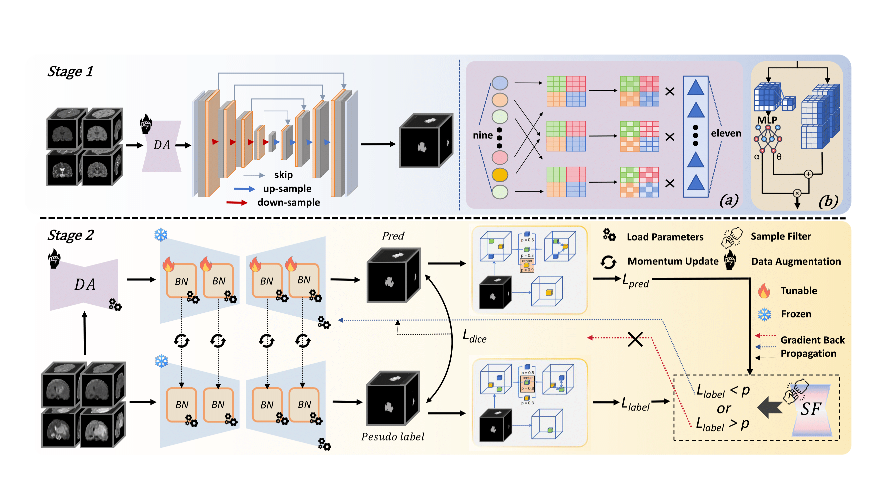
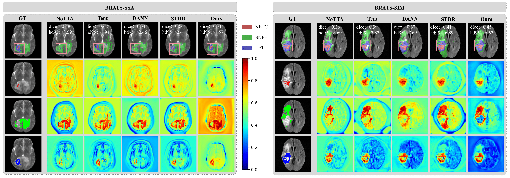

# DR-TTA

We propose a test-time adaptation method called DR-TTA (Dynamic and Robust Test-Time Adaptation). This method employs a dual-branch teacher-student architecture, where the teacher provides pseudo-label supervision, and the student adapts to domain shifts through augmented target samples. Additionally, DR-TTA integrates momentum updates and adaptive Batch Normalization to enhance feature alignment and maintain source knowledge.


Visual comparison of segmentation results on the BRATS-SSA and BRATS-SIM datasets. NoTTA indicates results before the different domain adaptation methods. Color legend: WT = red + green + blue, TC = red + blue, ET = red.


## 1. Environment
Please prepare an environment with Python 3.8, and then use the command "pip install -r requirements.txt" for the dependencies:
```
conda create -n DR-TTA python=3.8.20
conda activate DR-TTA
pip install -r requirements.txt
```

## 2. Data Preparation
- BraTS 2024-SSA:
```
python train_source.py
```

- BraTS 2024-SIM:
```
python train_source.py
```

## 3. Pre-Train in the source domain (BraTS 2024)
Run "train_source.py" to get a pre-trained weight:
```
python train_source.py
```
## 4. Test-time adaptation in the target domain (SSA/SIM)
Run "run_3d_upl.py" to get the result in the target domain. It contains both the training and test processes:
```
python run_3d_upl.py
```

## 5. Citation
```

```
