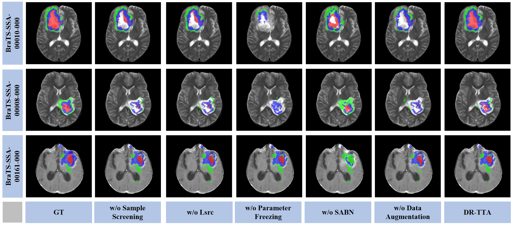

# 🧠 DR-TTA: Dynamic and Robust Test-Time Adaptation

We propose a test-time adaptation method called DR-TTA (Dynamic and Robust Test-Time Adaptation). This method employs a dual-branch teacher-student architecture, where the teacher provides pseudo-label supervision, and the student adapts to domain shifts through augmented target samples. Additionally, DR-TTA integrates momentum updates and adaptive Batch Normalization to enhance feature alignment and maintain source knowledge.


# 💡 Primary Contributions
Despite advances in SFUDA, two major challenges remain: (1) catastrophic forgetting, where models lose key source-domain knowledge during adaptation; (2) limited or low-quality target-domain data, producing unreliable pseudo-labels that degrade performance.
To address these, DR-TTA introduces:

Parameter Freezing & Momentum Updating: Freeze convolutional weights to retain source knowledge, update adaptive BatchNorm for cross-domain alignment, and use a momentum-updated teacher for pseudo-labels.

Dynamic Data Augmentation: Optimize weights across 11 augmentations via backpropagation to generate target-aligned samples.

Hybrid Loss & Sample Screening: Filter low-confidence samples and suppress noisy gradients to enhance robustness and stability.

# ⚡ Visual Comparison
Visual comparison of segmentation results on the BRATS-SSA and BRATS-SIM datasets. NoTTA indicates results before the different domain adaptation methods. Color legend: WT = red + green + blue, TC = red + blue, ET = red.


Visual comparison of segmentation results in the ablation study conducted on the BRATS-SSA dataset. The visual results demonstrate that removing any individual component from the DR-TTA framework leads to degraded segmentation quality, with notable boundary artifacts and region misclassifications. Color legend: WT = red + green + blue, TC = red + blue, ET = red.


## 🔧 Environment Setup
Please prepare an environment with Python 3.8, and then use the command "pip install -r requirements.txt" for the dependencies:

```
conda create -n DR-TTA python=3.8.20
conda activate DR-TTA
pip install -r requirements.txt

```


## 📁 Data Preparation
- BraTS 2024-SSA:
Pre-processed MRI scans (including T1, T1Gd, T2, and FLAIR) from the BRATS-SSA dataset (https://www.synapse.org/Synapse:syn59059780) were utilized in this study.

- BraTS 2024-SIM:

```
python sim_dataset_maker.py

```


## 🏋️ Pre-train on Source Domain (BraTS 2024)
Run "train_source.py" to get a pre-trained weight:

```
python train_source.py

```


## 🧪 Test-Time Adaptation in Target Domain (SSA/SIM)
Run "run_3d_upl.py" to get the result in the target domain. It contains both the training and test processes:

```
python run_3d_upl.py

```


## 📝 Citation

```


```
